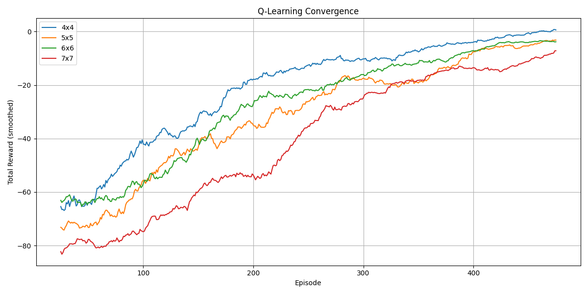

# 🧠 Reinforcement Learning - GridWorld Q-Learning

A simple implementation of **Q-learning** in a customizable **GridWorld environment**.  
The agent learns to navigate from the start position 🟩 to the goal 🎯 while avoiding obstacles ⬛.

---

## 🚀 Features

✅ Configurable grid size (e.g., 5×5, 10×10)  
✅ Random or fixed obstacles  
✅ Optional stochastic movement (adds exploration noise)  
✅ Q-Learning training with adjustable parameters  
✅ Smooth animation rendering 🎞 (saved as `.gif`)  
✅ Reward and success rate visualization 📊

---

## 🧩 Environment Rules

| Element | Symbol | Description |
|----------|---------|-------------|
| 🟩 Agent | `green` | Starts at top-left corner (0,0) |
| 🎯 Goal | `red` | Gives positive reward when reached |
| ⬛ Obstacle | `black` | Blocks movement and penalizes agent |
| ⚪ Empty Cell | `white` | Normal movement with step penalty |

---

## 🧮 Training Parameters

| Parameter | Description | Default |
|------------|--------------|----------|
| `alpha` | Learning rate | 0.1 |
| `gamma` | Discount factor | 0.95 |
| `epsilon` | Exploration rate | Starts at 1.0 → decays to 0.05 |
| `episodes` | Training episodes | 500 |
| `max_steps` | Steps per episode | 50 |

---

## 🎥 Training Visuals

| Episode | Description | GIF |
|----------|--------------|-----|
| 🏁 Episode 1 | Agent exploring randomly |  |
| 🧭 Episode 100 | Agent learning better paths |  |
| 🥇 Episode 500 | Agent efficiently reaching goal |  |

*(Replace the paths above with your generated GIFs.)*

---

## 📈 Results

### Smoothed Reward Curve



---

# 🧠 Part 2 — Q-Learning with Neural Networks + Animated GridWorld (GIFs)

This part extends the tabular Q-learning experiment by using a **Neural Network** to approximate the Q-function, enabling the agent to generalize better in larger grid environments.
It also adds **GIF generation** for visualizing the agent’s learning behavior in different episodes.

---

## 🚀 Overview

In this setup, the agent navigates through a **GridWorld** environment to reach the goal while avoiding obstacles.
Instead of a Q-table, we use a **fully connected neural network** to estimate Q-values for all possible actions from a given state.

Each state is represented as a **one-hot vector**, and the network learns to approximate:
[
Q(s, a) \approx \text{expected discounted return for taking action } a \text{ in state } s
]

---

## 🧩 Key Features

* **Dynamic environment**: Random obstacles and a fixed goal.
* **Neural Network (Q-Network)** for Q-value prediction.
* **Epsilon-greedy exploration** strategy.
* **Training loss and reward tracking** over episodes.
* **GIF generation** for visualizing selected episodes (`0`, middle, and last).

---

## ⚙️ How It Works

1. **Environment (`GridWorld`)**

   * Agent starts at the top-left corner `(0, 0)`.
   * Goal is always at the bottom-right corner.
   * Random obstacles are placed except on start and goal cells.
   * Rewards:

     * `+10` for reaching the goal
     * `-5` for hitting an obstacle
     * `-1` for normal movement

2. **Neural Q-Network**

   * Input: One-hot encoded state (`size²` vector)
   * Output: Estimated Q-values for the 4 possible actions
   * Architecture:

     ```python
     Linear(size² → 128) → ReLU → Linear(128 → 64) → ReLU → Linear(64 → 4)
     ```

3. **Training**

   * Q-learning target:
     [
     y = r + \gamma \max_{a'} Q(s', a')
     ]
   * Loss: Mean Squared Error (MSE)
   * Optimizer: Adam

4. **Exploration Decay**

   * Epsilon (`ε`) decreases linearly from `1.0` → `0.05` across episodes.

5. **Visualization**

   * During selected episodes (e.g. first, middle, last), the environment frames are stored.
   * At the end, each recorded episode is saved as a `.gif`.

---

## 📊 Output and Results

* **Plots generated:**

  * `Reward per Episode`
  * `Training Loss per Episode`

* **Final Metrics:**

  * Displays average success rate over the last 100 episodes.

* **GIFs saved:**

  * `nn_gridworld_ep1.gif`
  * `nn_gridworld_ep300.gif`
  * `nn_gridworld_ep600.gif`

* **Heatmaps:**

  * **State Value Map:** Maximum Q-value per grid cell.
  * **Best Action Map:** Shows the learned best action (encoded as color).

---

## 🧠 Insights

* Neural Q-learning generalizes better than a table-based approach, especially as grid size increases.
* Training is more stable when learning rate is small (`1e-3` or lower).
* GIFs clearly show how the agent progressively learns to avoid obstacles and move efficiently toward the goal.

---

## 🏃‍♂️ Run It

```bash
python q_learning_nn_gridworld.py
```

To save episode animations, make sure the `gif_prefix` argument is set (e.g., `"nn_gridworld"`).

---

## 🔁 Next Steps

In the next stage, we can:

* Replace one-hot state encoding with CNN-based state encoding.
* Add experience replay and target networks (i.e., implement **Deep Q-Learning (DQN)**).
* Test generalization on larger, more complex mazes.

