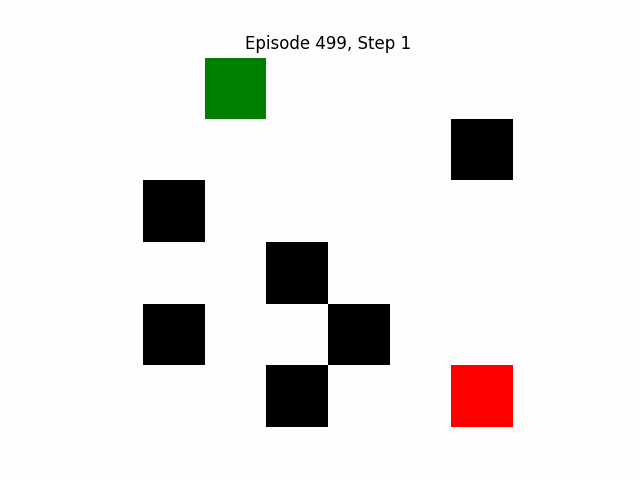

# 🧠 Reinforcement Learning - GridWorld Q-Learning

A simple implementation of **Q-learning** in a customizable **GridWorld environment**.  
The agent learns to navigate from the start position 🟩 to the goal 🎯 while avoiding obstacles ⬛.

---

## 🚀 Features

✅ Configurable grid size (e.g., 5×5, 10×10)  
✅ Random or fixed obstacles  
✅ Optional stochastic movement (adds exploration noise)  
✅ Q-Learning training with adjustable parameters  
✅ Smooth animation rendering 🎞 (saved as `.gif`)  
✅ Reward and success rate visualization 📊

---

## 🧩 Environment Rules

| Element | Symbol | Description |
|----------|---------|-------------|
| 🟩 Agent | `green` | Starts at top-left corner (0,0) |
| 🎯 Goal | `red` | Gives positive reward when reached |
| ⬛ Obstacle | `black` | Blocks movement and penalizes agent |
| ⚪ Empty Cell | `white` | Normal movement with step penalty |

---

## 🧮 Training Parameters

| Parameter | Description | Default |
|------------|--------------|----------|
| `alpha` | Learning rate | 0.1 |
| `gamma` | Discount factor | 0.95 |
| `epsilon` | Exploration rate | Starts at 1.0 → decays to 0.05 |
| `episodes` | Training episodes | 500 |
| `max_steps` | Steps per episode | 50 |

---

## 🎥 Training Visuals

| Episode | Description | GIF |
|----------|--------------|-----|
| 🏁 Episode 1 | Agent exploring randomly |  |
| 🧭 Episode 100 | Agent learning better paths |  |
| 🥇 Episode 500 | Agent efficiently reaching goal |  |

*(Replace the paths above with your generated GIFs.)*

---

## 📈 Results

### Smoothed Reward Curve
*(Auto-generated during training)*

